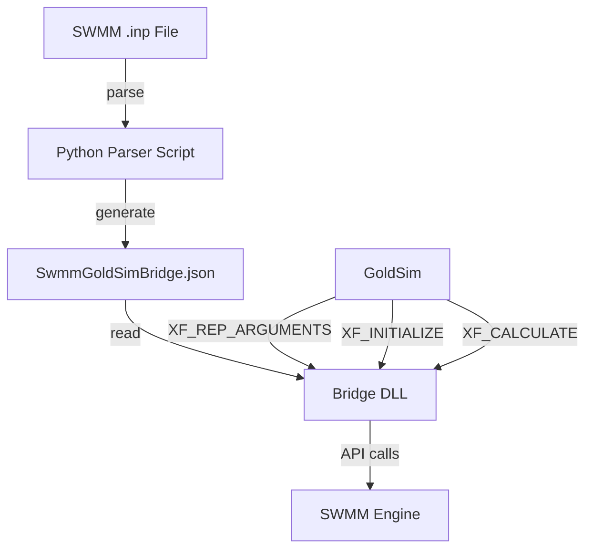

# Design Document: Scripted Interface Mapping

## Overview

This design implements a dynamic interface mapping system for the GoldSim-SWMM Bridge DLL. The system consists of two main components:

1. **Python Parser Script** (`generate_mapping.py`): Analyzes SWMM .inp files and generates a JSON mapping file
2. **Enhanced Bridge DLL**: Reads the mapping file at runtime to dynamically configure its interface

The design eliminates hardcoded interface definitions (currently `INPUT_COUNT = 2`, `OUTPUT_COUNT = 1`) and replaces them with runtime configuration based on the actual SWMM model structure.

### Key Design Decisions

- **JSON for mapping format**: Human-readable, widely supported, easy to parse in both Python and C++
- **Static mapping file**: Generated once per model, consumed at runtime (no runtime parsing of .inp files)
- **Backward compatibility**: Existing DLL structure preserved, only interface discovery is dynamic
- **Hash-based validation**: MD5 hash of .inp file content enables detection of model changes

## Architecture

### Component Diagram



### Data Flow

1. **Pre-simulation**: User runs `generate_mapping.py model.inp` to create `SwmmGoldSimBridge.json`
2. **XF_REP_ARGUMENTS**: DLL reads JSON, returns input/output counts to GoldSim
3. **XF_INITIALIZE**: DLL reads JSON, obtains SWMM API handles for all mapped elements
4. **XF_CALCULATE**: DLL iterates through mappings to set inputs and retrieve outputs

## Components and Interfaces

### 1. Python Parser Script (`generate_mapping.py`)

**Responsibilities:**
- Parse SWMM .inp file sections
- Discover input elements (rain gages with DUMMY timeseries)
- Discover output elements (storage, outfalls, orifices, weirs, subcatchments)
- Generate JSON mapping file
- Compute content hash for validation

**Public Interface:**
```python
def parse_inp_file(inp_path: str) -> dict
def discover_inputs(sections: dict) -> list[InputElement]
def discover_outputs(sections: dict) -> list[OutputElement]
def compute_hash(inp_path: str) -> str
def generate_mapping(inp_path: str, output_path: str) -> None
def main() -> int
```

**Key Data Structures:**
```python
@dataclass
class InputElement:
    name: str           # Element name from SWMM
    object_type: str    # "GAGE"
    index: int          # Interface index (0-based)

@dataclass
class OutputElement:
    name: str           # Element name from SWMM
    object_type: str    # "STORAGE", "OUTFALL", "ORIFICE", "WEIR", "SUBCATCH"
    value_type: str     # "VOLUME", "FLOW", "RUNOFF"
    index: int          # Interface index (0-based)
```

### 2. JSON Mapping File (`SwmmGoldSimBridge.json`)

**Schema:**
```json
{
  "version": "1.0",
  "inp_file_hash": "a1b2c3d4e5f6...",
  "input_count": 3,
  "output_count": 5,
  "inputs": [
    {
      "index": 0,
      "name": "ElapsedTime",
      "object_type": "SYSTEM",
      "property": "ELAPSEDTIME"
    },
    {
      "index": 1,
      "name": "RG1",
      "object_type": "GAGE",
      "property": "RAINFALL"
    }
  ],
  "outputs": [
    {
      "index": 0,
      "name": "POND1",
      "object_type": "STORAGE",
      "property": "VOLUME",
      "swmm_index": 0
    },
    {
      "index": 1,
      "name": "OUT1",
      "object_type": "OUTFALL",
      "property": "FLOW",
      "swmm_index": 0
    },
    {
      "index": 2,
      "name": "S1",
      "object_type": "SUBCATCH",
      "property": "RUNOFF",
      "swmm_index": 0
    }
  ]
}
```

### 3. Enhanced Bridge DLL

**New Components:**

**MappingLoader Class:**
```cpp
class MappingLoader {
public:
    struct InputMapping {
        int interface_index;
        std::string name;
        std::string object_type;
        int swmm_property;
        int swmm_index;
    };
    
    struct OutputMapping {
        int interface_index;
        std::string name;
        std::string object_type;
        int swmm_property;
        int swmm_index;
    };
    
    bool LoadFromFile(const std::string& path, std::string& error);
    int GetInputCount() const;
    int GetOutputCount() const;
    const std::vector<InputMapping>& GetInputs() const;
    const std::vector<OutputMapping>& GetOutputs() const;
    const std::string& GetHash() const;
    
private:
    std::vector<InputMapping> inputs_;
    std::vector<OutputMapping> outputs_;
    std::string inp_hash_;
};
```

**Modified SwmmSimulation Class:**
```cpp
class SwmmSimulation {
public:
    bool Initialize(const MappingLoader& mapping, std::string& error);
    bool Calculate(const double* inargs, double* outargs, 
                   const MappingLoader& mapping, std::string& error);
    
private:
    bool ValidateMapping(const MappingLoader& mapping, std::string& error);
    bool ResolveIndices(const MappingLoader& mapping, std::string& error);
    
    std::vector<int> input_indices_;
    std::vector<int> output_indices_;
};
```

**Modified BridgeHandler Class:**
```cpp
class BridgeHandler {
private:
    SwmmSimulation simulation_;
    MappingLoader mapping_;
    bool mapping_loaded_;
    
    void HandleReportArguments(int* status, double* outargs, std::string& error);
    void HandleInitialize(int* status, double* outargs, std::string& error);
    void HandleCalculate(int* status, double* inargs, double* outargs, std::string& error);
};
```

## Data Models

### SWMM Section Parsing

**Section Format:**
```
[SECTION_NAME]
;;Comment line
Name1  Field1  Field2  Field3
Name2  Field1  Field2  Field3
```

**Parsing Rules:**
- Section headers: `[SECTION_NAME]`
- Comments: Lines starting with `;`
- Data lines: Whitespace-separated fields
- First field is typically the element name

### SWMM Object Type Mapping

| SWMM Section | Object Type | SWMM API Type | Property |
|--------------|-------------|---------------|----------|
| RAINGAGES | GAGE | swmm_GAGE | swmm_GAGE_RAINFALL |
| STORAGE | NODE | swmm_NODE | swmm_NODE_VOLUME |
| OUTFALLS | NODE | swmm_NODE | swmm_LINK_FLOW (via connected link) |
| ORIFICES | LINK | swmm_LINK | swmm_LINK_FLOW |
| WEIRS | LINK | swmm_LINK | swmm_LINK_FLOW |
| SUBCATCHMENTS | SUBCATCH | swmm_SUBCATCH | swmm_SUBCATCH_RUNOFF |

**Note:** Outfalls report flow through their incoming links, not node properties directly. The design will use the outfall node's inflow property (swmm_NODE_INFLOW) for simplicity.

### Interface Index Assignment

**Inputs:**
```
Index 0: Elapsed Time (always present)
Index 1: First DUMMY rain gage
Index 2: Second DUMMY rain gage
...
Index N: Nth DUMMY rain gage
```

**Outputs:**
```
Index 0: First storage node
...
Index M: Last storage node
Index M+1: First outfall
...
Index M+K: Last outfall
Index M+K+1: First orifice
...
(continue with weirs, then subcatchments)
```

## Error Handling

### Parser Script Error Handling

**File Errors:**
- Missing .inp file → Exit with error message and status code 1
- Unreadable file → Exit with error message and status code 1
- Invalid JSON output path → Exit with error message and status code 1

**Parsing Errors:**
- Malformed section header → Log warning, skip section
- Invalid data line → Log warning, skip line
- Missing required fields → Log warning, skip element

**Validation Errors:**
- No inputs discovered → Warning (elapsed time only is valid)
- No outputs discovered → Warning (valid but unusual)
- Duplicate element names → Error, exit with status code 1

### DLL Error Handling

**Mapping File Errors:**
- File not found → Return XF_FAILURE_WITH_MSG: "Mapping file not found: SwmmGoldSimBridge.json"
- Invalid JSON → Return XF_FAILURE_WITH_MSG: "Invalid mapping file format"
- Missing required fields → Return XF_FAILURE_WITH_MSG: "Mapping file missing required field: {field}"

**SWMM API Errors:**
- Element not found → Return XF_FAILURE_WITH_MSG: "SWMM element not found: {name}"
- Invalid index → Return XF_FAILURE_WITH_MSG: "Invalid SWMM index for element: {name}"
- API call failure → Return XF_FAILURE_WITH_MSG with SWMM error message

**Hash Mismatch:**
- Hash mismatch → Log warning to bridge_debug.log, continue execution
- Rationale: Allow execution but warn user that mapping may be stale

## Testing Strategy

### Unit Testing

**Python Parser Tests:**
- Test parsing each SWMM section independently
- Test handling of missing sections
- Test handling of malformed data
- Test hash computation consistency
- Test JSON generation format

**DLL Tests:**
- Test MappingLoader with valid JSON
- Test MappingLoader with invalid JSON
- Test MappingLoader with missing file
- Test index resolution with valid mapping
- Test index resolution with invalid element names
- Test error message formatting

### Integration Testing

**End-to-End Tests:**
- Generate mapping from test_model.inp
- Load mapping in DLL
- Verify XF_REP_ARGUMENTS returns correct counts
- Verify XF_INITIALIZE resolves all indices
- Verify XF_CALCULATE sets and retrieves correct values

### Property-Based Testing

Property-based tests will validate universal properties across randomized inputs. Each property test will run a minimum of 100 iterations to ensure comprehensive coverage.


## Correctness Properties

A property is a characteristic or behavior that should hold true across all valid executions of a system—essentially, a formal statement about what the system should do. Properties serve as the bridge between human-readable specifications and machine-verifiable correctness guarantees.

### Property Reflection

After analyzing all acceptance criteria, several properties can be consolidated:
- Properties 3.1-3.5 (individual section parsing) can be combined into a single comprehensive property about output discovery
- Properties 4.3-4.7 (individual JSON fields) can be combined into a property about JSON structure completeness
- Properties 6.4-6.5 (input/output count reporting) can be combined into a single property
- Properties 7.2-7.3 (handle resolution for inputs/outputs) can be combined
- Properties 8.1 and 8.3 (iterating through mappings) can be combined

### Parser Script Properties

**Property 1: Valid INP files are successfully parsed**
*For any* valid SWMM .inp file, the parser should successfully read and parse the file without errors, returning a structured representation of all sections.
**Validates: Requirements 1.1**

**Property 2: Comments are excluded from parsing**
*For any* .inp file content with comment lines (starting with semicolons), the parsed output should not contain any comment text.
**Validates: Requirements 1.4**

**Property 3: Section headers are correctly identified**
*For any* .inp file with section headers enclosed in square brackets, the parser should correctly identify and categorize all sections.
**Validates: Requirements 1.5**

**Property 4: Elapsed time is always first input**
*For any* SWMM model configuration, the generated mapping should always assign elapsed time to Interface_Index 0 in the inputs array.
**Validates: Requirements 2.1**

**Property 5: DUMMY rain gages are discovered as inputs**
*For any* .inp file with rain gages using TIMESERIES named DUMMY, all such gages should appear in the inputs array with sequential indices starting from 1.
**Validates: Requirements 2.2, 2.3**

**Property 6: Non-DUMMY rain gages are excluded**
*For any* rain gage using a timeseries other than DUMMY, that gage should not appear in the generated inputs array.
**Validates: Requirements 2.5**

**Property 7: All output elements are discovered**
*For any* .inp file containing storage nodes, outfalls, orifices, weirs, or subcatchments, all such elements should appear in the outputs array with the correct object type and value type.
**Validates: Requirements 3.1, 3.2, 3.3, 3.4, 3.5**

**Property 8: Output priority ordering is preserved**
*For any* .inp file with multiple output element types, the generated mapping should order outputs as: storage nodes, then outfalls, then orifices, then weirs, then subcatchments.
**Validates: Requirements 3.6**

**Property 9: Element order within sections is preserved**
*For any* section with multiple elements, the generated mapping should preserve the order in which elements appear in the .inp file.
**Validates: Requirements 3.7**

**Property 10: Generated mapping is valid JSON**
*For any* valid .inp file, the generated mapping file should be valid JSON that can be parsed without errors.
**Validates: Requirements 4.1**

**Property 11: Mapping contains required structure**
*For any* generated mapping file, it should contain all required fields: version, inp_file_hash, input_count, output_count, inputs array, and outputs array, with counts matching array lengths.
**Validates: Requirements 4.3, 4.4, 4.5, 4.6, 4.7**

**Property 12: Hash computation is deterministic**
*For any* .inp file, computing the hash multiple times should produce the same hash value.
**Validates: Requirements 5.1, 5.2**

**Property 13: Hash excludes comments and whitespace**
*For any* two .inp files with identical content but different comments or whitespace, the computed hashes should be equal.
**Validates: Requirements 5.3**

**Property 14: Hash is sensitive to content changes**
*For any* .inp file, modifying any non-comment, non-whitespace content should produce a different hash value.
**Validates: Requirements 5.4**

**Property 15: Missing sections are treated as empty**
*For any* .inp file with missing optional sections, the parser should treat them as empty and not fail, generating a valid mapping with zero elements from those sections.
**Validates: Requirements 10.1, 10.4**

**Property 16: Invalid syntax produces errors**
*For any* .inp file with malformed section headers or invalid syntax, the parser should return an error message describing the failure.
**Validates: Requirements 1.3**

**Property 17: Error conditions produce non-zero exit codes**
*For any* error condition (missing file, invalid syntax, etc.), the parser script should exit with a non-zero status code.
**Validates: Requirements 9.5**

### DLL Properties

**Property 18: Valid mappings return correct argument counts**
*For any* valid mapping file, when XF_REP_ARGUMENTS is called, the DLL should return the input_count and output_count values from the mapping.
**Validates: Requirements 6.4, 6.5**

**Property 19: Invalid JSON produces errors**
*For any* mapping file containing invalid JSON, the DLL should return XF_FAILURE_WITH_MSG with a descriptive error message.
**Validates: Requirements 6.3**

**Property 20: All mapped elements resolve to handles**
*For any* valid mapping file with elements that exist in the SWMM model, the DLL should successfully obtain SWMM API handles for all input and output elements during XF_INITIALIZE.
**Validates: Requirements 7.2, 7.3, 7.6**

**Property 21: Invalid element names produce errors**
*For any* mapping file containing element names that don't exist in the SWMM model, the DLL should return an error status during XF_INITIALIZE.
**Validates: Requirements 7.4**

**Property 22: All inputs are processed during calculation**
*For any* valid mapping with N input elements, when XF_CALCULATE is called, the DLL should call swmm_setValue exactly N-1 times (excluding elapsed time) with values from the inargs array.
**Validates: Requirements 8.1, 8.2**

**Property 23: All outputs are retrieved during calculation**
*For any* valid mapping with M output elements, when XF_CALCULATE is called, the DLL should call swmm_getValue exactly M times and populate the outargs array in the order specified by the mapping.
**Validates: Requirements 8.3, 8.4, 8.5**

**Property 24: Invalid handles produce errors**
*For any* calculation with invalid element handles, the DLL should return an error status.
**Validates: Requirements 8.6**

### Integration Properties

**Property 25: Mapping generation is idempotent**
*For any* .inp file, running the parser multiple times should produce identical mapping files (same content, same hash).
**Validates: Requirements 4.8**

**Property 26: Round-trip consistency**
*For any* .inp file, generating a mapping and then using that mapping in the DLL should result in the DLL reporting the same input/output counts that the parser discovered.
**Validates: Requirements 2.1-2.5, 3.1-3.7, 6.4-6.5**

